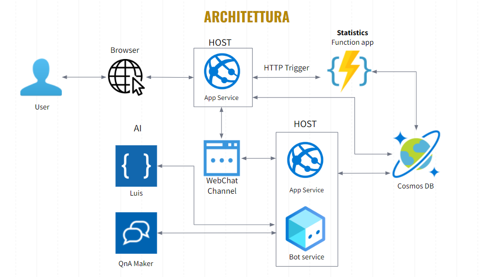

#	TÈ-mptation
A project for the class on Cloud Computing at Università degli Studi di Salerno

#	Introduction
Temptation is a cloud-based web application for a Tea Room that aims to :

 - facilitate staff management of the lounge 
 - help customers with the fulfillment of their orders 
 - alleviate staff work through the use of a bot called Connor

The entire project is made using Microsoft Azure stuffs.
# Project architectures
  
To show the architecture let us put ourselves in the shoes of a user. This arrives on the web app via a browser, the app service is called to obtain the data needed to view the site, once logged in/registered, by retrieving or saving user information from the DB, it can access its Dashboard and see statistics regarding drinks. The management of the statistics is delegated to a function app in such a way, by calling it through an HTTP Trigger launched when the Dashboard is opened, queries are run on the database to obtain the information needed to process the statistics. 
At any time the user can communicate with a bot, via the WebChat channel to obtain information or advice. The bot is always synchronized with the Web app, in fact it will take data from the DB regarding available drinks or extras to be added and will respond to users based on the question posed to it through the use of Luis' services to determine the intent of the question and QnA Maker to answer specific questions or curiosities not related to ordering
# Project structures
Current repo contains the Serverless function developed in Python that triggered on HTTP Request execute queries on a NoSQL Cosmos DB, and put JSON results in the response.

[This repo](https://github.com/AlessioCasolaro/Te-mptation) repo contains the web application developed in Node JS.

[This repo](https://github.com/AlessioCasolaro/ConnorBot) contains the Azure BOT that we have called *Connor* made with Javascript, it is been used with QnA Maker, used to answer simple questions about the shop, and LUIS AI to ask for suggestions on how to make your own drink, choosing from a list placed on the DB.
 

#	Authors
[**AlessioCasolaro**](https://github.com/AlessioCasolaro) - [**CiroMaiorino**](https://github.com/CiroMaiorino)
